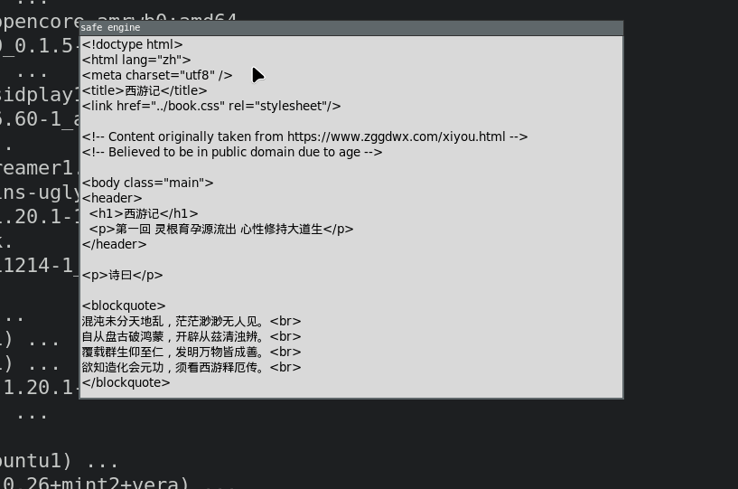

# safe browser
safe as in slow as fuck engine, is a browser engine written in python **only works with http and https version 1.0**     
fellowing [browser engineering website](https://browser.engineering/). 

# Steps
those are the steps i am taking to build the safe engine, i will get to doing exos.          
- [ ] implement HTTP/1.0 and HTTP/1.1 protocol 
    - [x] implementation 
    - [ ] exercises 
- [ ] render the http reponse body aka the website
    - [x] implementation 
    - [ ] exercises 

## ScreenShots
### Simple Ui With Scrolling
     